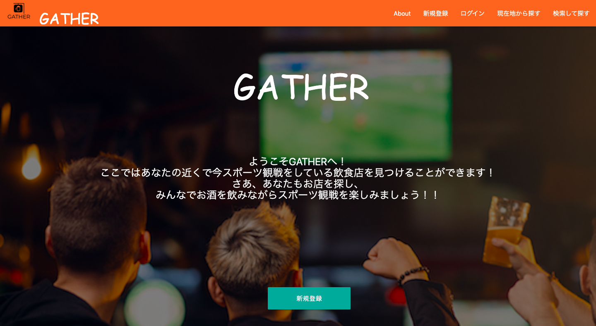
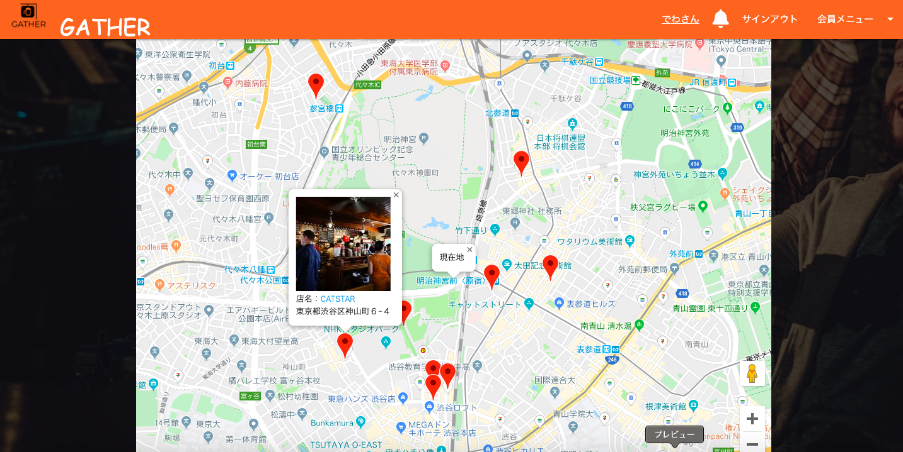
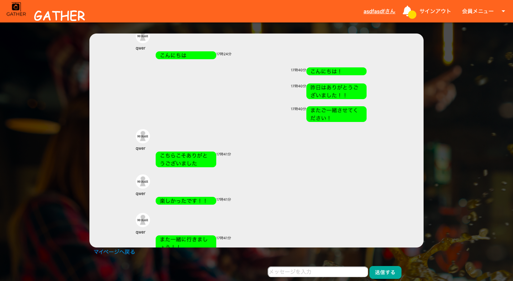

GATHER
====

現在地付近のスポーツ観戦している飲食店を発信・探すSNSサイト 
URL: https://www.2019gather.me

## 使用技術
- Ruby 2.5.7, Rails 5.2.3
- Nginx, Puma
- AWS(EC2, RDS,Route53, ALB, ACM)
- Vagrant, Virtual Box
- SASS, Material　Design, JQuery

## サイト概要

他の人と一緒に食べたり飲んでりしながらスポーツ観戦をしたい時、 
このサイトを利用することによって今スポーツ観戦をしている飲食店を見るけることができます。 
また、自分がいる飲食店で、スポーツ観戦をしている場合、お店の雰囲気・空席の有無・観戦しているスポーツを他の人に発信することができます。 
飲食店オーナーの場合は、自分のお店をサイトに登録し、発信することによって集客効果も見込めます。

## サイトイメージ

## 機能
- ユーザー登録・ログイン機能（devise）
- ソーシャル認証、ログイン機能(Fascebook)
- 飲食店検索機能（GooglemapAPI+Ransack+GeocordingAPI）
- 友達申請によるフレンド機能
- いいね機能
- お問い合わせ機能(ActionMaler)
- Line風チャット・DM機能(ActionCable)
- 通知機能(自分の投稿に対するコメント、友達申請、チャット)
- 投稿・コメント機能（コメント機能は非同期通信）
- 投稿に対する画像セーフサーチ機能(GoogleVisionAPI)
- 文章の感情分析によるランキング機能(CloudNaturalLanguageAPI)

## 使い方
- （未ログイン時） 
「現在地から探す」でGooglemapで現在地情報を取得し、付近のスポーツ観戦をしている飲食店にピンが表示されます。 
ピンをクリックすると、お店の情報の表示、お店詳細ページのリンクが表示されます。 
「検索して探す」では、店名・スポーツ名・住所で飲食店を検索することもできます。

- （ログイン時） 
上記に加えてログインすると、自分がスポーツ観戦している飲食店の状況を投稿し、他の人に発信し呼びかけることができます。 
また投稿を見たユーザーはコメントをすることができ、他ユーザーと空席の確認や現在の状況などのやりとりが可能です。 
気に入った飲食店があればお気に入り登録することができ、お気に入り一覧ページで自分がお気にり飲食店の一覧を確認することができます。 
他のユーザーには友達申請を送ることができ、お互い友達申請を送るとリアルタイムの個人チャットをすることができます。 
投稿された文字を分析し、ポジティブな発言が多いお店のTOP3をおすすめのお店として、お店の一覧画面の上部に表示します。 
サイト内の投稿やコメントで、誹謗中傷の内容などがあった場合は、サイト運営者にお問い合わせという形で、意見等を送信することができます。 
管理者が内容を確認次第登録しているメールアドレスへ回答を返信させていただきます。 
投稿された文字を分析し、ポジティブな発言が多いお店のTOP3をおすすめのお店として、お店の一覧画面の上部に表示します。

## 作成のきっかけ
２０１９年に入り、ラグビーや・サッカー・バレーボールなどスポーツ熱が強くなってきており、翌年に東京オリンピックが控えているということもあり、
大勢でより楽しくスポーツ観戦ができることを願い作成した。 
また、現在飲食店検索手段の主流となっている「食べログ」等のサイトに掲示されていない、または評価が低くなってしまっている飲食店でも
素晴らしい飲食店は数多くあると思ったため、そういった飲食店を知ってもらうきっかけ作りができればと考え作成した。

## 製作者

出羽　真（DEAW MAKOTO）kzspreonerad86@yahoo.co.jp

